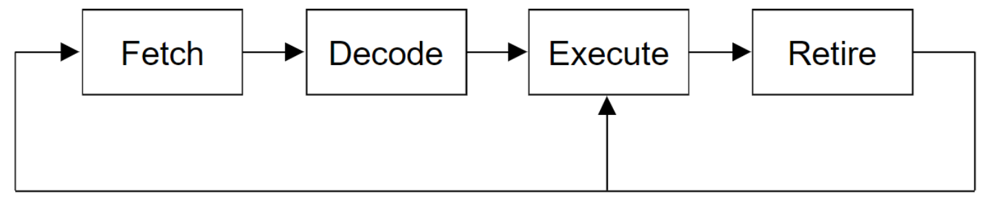

# Cykl rozkazowy procesora
Wielokrotność[[Cykl maszynowy| cykli maszynowych]] procesora, które składają się na wykonanie jednego [[Rozkaz|rozkazu]]

### Ogólne Fazy
- [[Faza pobrania rozkazu|Fetch]]
- [[Faza dekodowania rozkazu|Decode]]
- [[Faza wykonania|Execute]]
- [[Faza zapisania wyników|Retire]]

Czasem następuje sprzeżenie zwrotne i faza wyniku wraca do fazy wykonywania np. w przypadku wykonywania [[Rozkaz złożony|rozkazu złożonego]]

[[Architektura systemów komputerowych]]