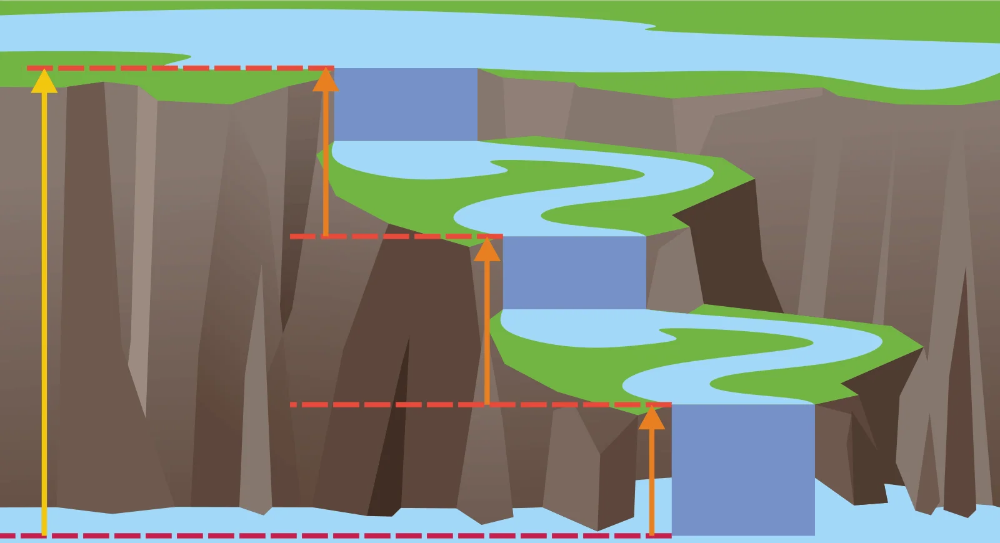

# Drugie prawo Kirchhoffa
W [[Obwód zamknięty|zamkniętym obwodzie]] suma [[Spadek napięcia|spadków napięć]] jest równa 0.

Inaczej: Suma [[Napięcie|napięć]] pochodzących od [[Źródło zasilania|źródeł zasilania]] jest równa sumie napięć na pozostałych elementach.

[[Napięcie|Napięcia]] na równolegle połączonych elementach są takie same, ponieważ są podłączone do tego samego zailania.

### Intuicja

[[Elektronika]]