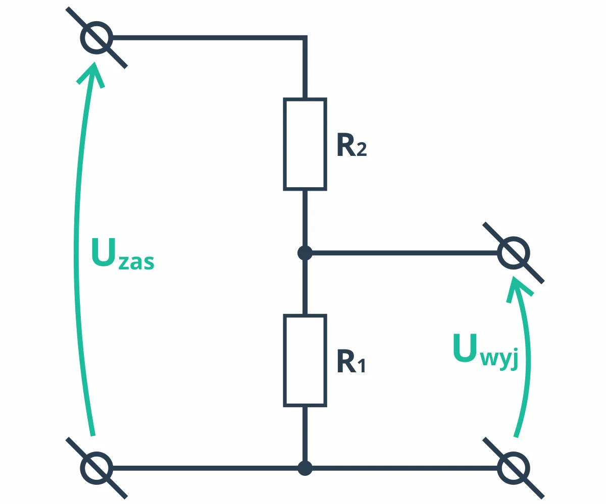

# Dzielnik [[Napięcie|napięcia]]
Dzielnik napięcia pozwala zmniejszyć [[Napięcie|napięcie]] poprzez zastosowanie [[Połączenie szeregowe rezystorów|szeregowo połączonych rezystorów]].

**Uwaga:** dzielnik napięcia nie może pobierać dużego prądu, więc nie nadaje się do np. zasilania silników (wyjaśnienie: [[Rezystancja wewnętrzna]])

$$U_\text{wyj}=U_\text{zas}(\frac{R_1}{R_1+R_2})$$
gdzie:
- $U_\text{zas}$ -  [[Napięcie]] [[Źródło zasilania|zasilania]]
- $U_\text{wyj}$ - [[Napięcie]] na wyjściu dzielnika

### Wyprowadzenie
[[Spadek napięcia]] na $R_2$ jest równy:
$$U_\text{zas}\cdot \frac{R_2}{R_1+R_2}$$Z [[Drugie prawo Kirchhoffa|drugiego prawa Kirchhoffa]] wiadomo że [[Napięcie|napięcie]] na [[Rezystor|rezystorach]] $R_1$ i $R_2$ sumują się do $U_\text{zas}$, więc:
$$U_\text{wyj}=U_\text{zas}-U_\text{zas}\cdot \frac{R_2}{R_1+R_2}=U_\text{zas}(1-{\frac{R_2}{R_1+R_2}})=U_\text{zas}(\frac{R_1+R_2}{R_1+R_2}-\frac{R_2}{R_1+R_2})=U_\text{zas}(\frac{R_1}{R_1+R_2})$$

[[Elektronika]]