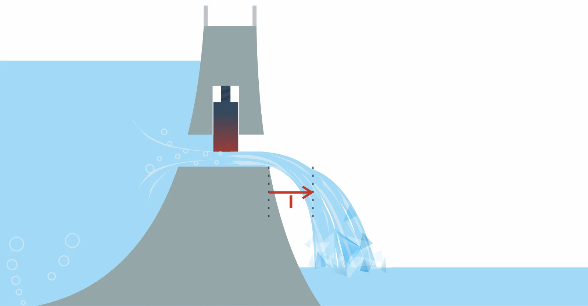

# Natężenie prądu (prąd)
### Definicja
Stosunek wartości [[Ładunek elektryczny|ładunku elektrycznego]] przepływającego przez wyznaczoną powierzchnię do czasu przepływu ładunku

### Symbol
$I$
### Jednostka
Amper $[A]$

### Wzór
$$I=\frac{dq}{dt}$$
### Intuicja

Czym szybciej / więcej ładunki przepływają (krople wody) tym dalej woda poleci / tym więcej wody wyleci.

[[Elektronika]]