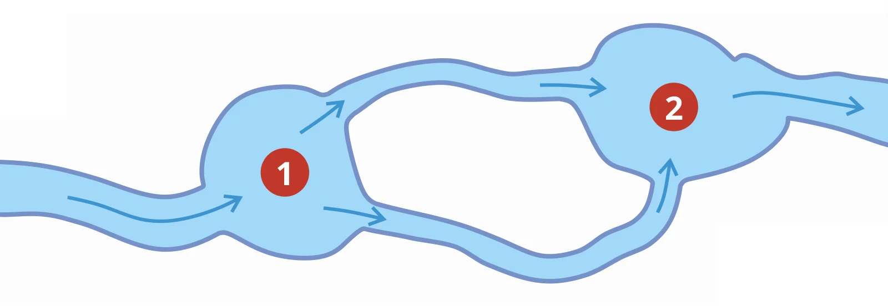
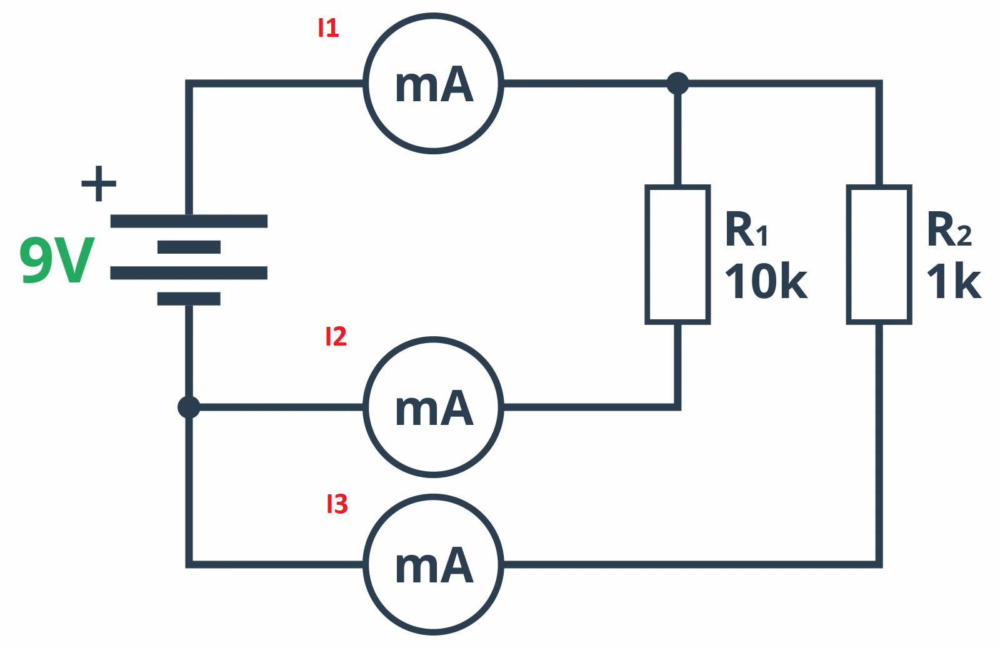

# Pierwsze prawo Kirchhoffa
Tyle samo [[Prąd elektryczny|prądu]] wypływa z danego [[Węzeł|węzła]], co do niego wpływa.
Jeżeli tyle samo [[Prąd elektryczny|prądu]] wypływa do znaczy, że jest takie samo [[Natężenie|natężenie]].

### Intuicja

Tyle samo [[Prąd elektryczny|prądu]] (wody) wpłynie i wypłynie z [[Węzeł|węzłów]] 1 i 2.

### Przykład

$$I_1=I_2+I_3$$

[[Elektronika]]