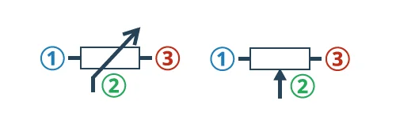

# Potencjometr
[[Rezystor]] z relulowaną [[Rezystancja|rezystancją]].
Regulacja za pomocą pokrętła.

Jest zbudowany z [[Dzielnik napięcia|dzielnika napięcia]].

### Symbol

### Działanie

Działanie na zasadzie [[Dzielnik napięcia|dzielnika napięcia]]:
Pokrętło potencjometru zmniejsza rezystancję $R_2$ i jednocześnie zwiększa $R_1$ lub na odwór w zależności od kierunku kręcenia.
Środkowa nużka potencjometru (nr. 2 na schemacie) służy do podłączenia $U_\text{wyj}$.

[[Elektronika]]