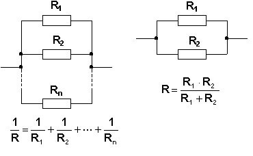

# [[Połączenie równoległe]] [[Rezystor|rezystorów]]
$$\frac{1}{R_z}=\sum_i \frac{1}{R_i}$$
gdzie:
- $R_z$ - [[Rezystancja zastępcza]]
- $R_i$ - [[Rezystancja]] i-tego, równoległego [[Rezystor|rezystora]]

Np. dla dwóch [[Rezystor|rezystorów]]: $R_z=\frac{R_1R_2}{R_1+R_2}$

### Wyprowadzenie
Z [[Pierwsze prawo Kirchhoffa|pierwszego prawa Kitchhoffa]] wiadomo, że:
$$I=\sum_iI_i$$
Z [[Drugie prawo Kirchhoffa|drugiego prawa kirchhoffa]] wiadomo że, [[Napięcie|napięcia]] na równoległych rezystorach będą te same.
Następnie z [[Prawo Ohma|prawa Ohma]]:
$$\frac{V}{R_z}=\sum_i\frac{V}{R_i}$$
podzielić przez V daje wzór:
$$\frac{1}{R_z}=\sum_i\frac{1}{R_i}$$
[[Elektronika]]