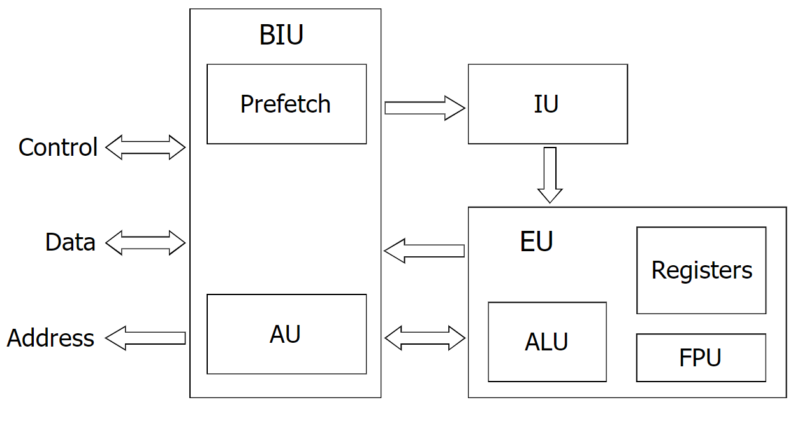

# Procesor
*Centralna jednostka obliczeniowa
Central processing unit (CPU)*
### Elementy procesora
- [[Układ sterowania miagistralami]] (BIU)
- [[Dekoder instrukcji]] (IU)
- [[Układ wykonawczy]] (EU)

### Schemat blokowy

[[Architektura systemów komputerowych]]