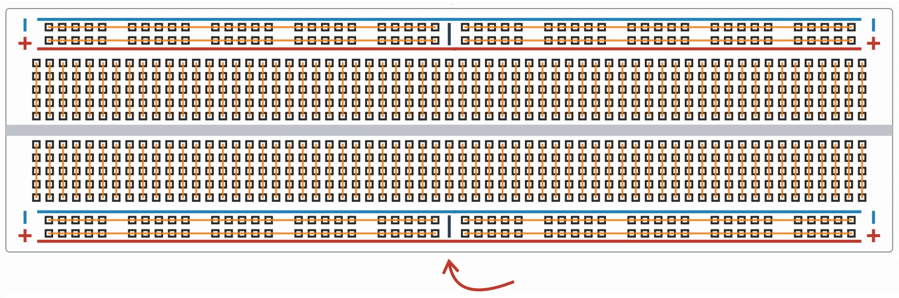
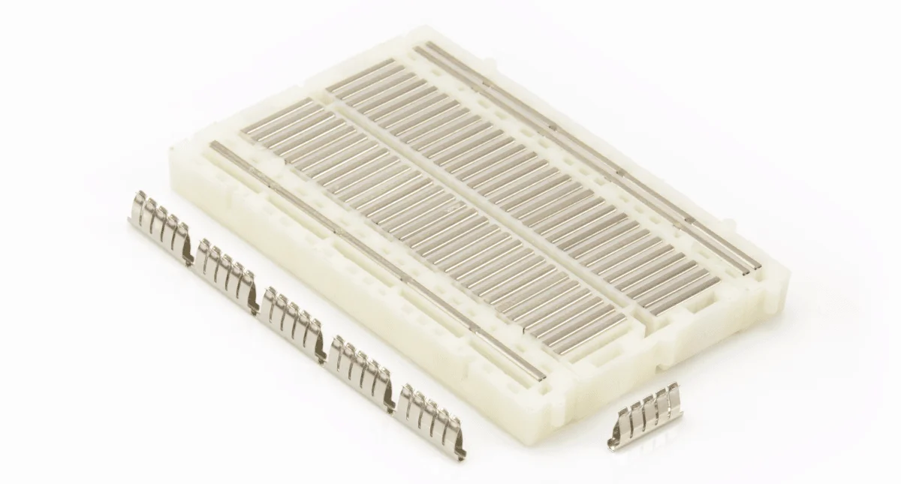

# Płytka stykowa
*Breadboard*

### Schemat

*Duża płytka stykowa (830 otworów)* 

Płytka zbudowana jest z 2 głównych kolumn. Każdy wiersz w kolumnie to połączone ze sobą 5 wejść. 

Istnienie dwóch kolumn jest konieczne, aby podłączyć np. [[Układ scalony|układ scalony]]. Podłączenie do jednej kolumy spowodowałoby [[Zwarcie|zwarcie]] dwóch przeciwległych nóżek.

Na zawnątrz obu kolumn są dwie linie służące do doprowadzania [[Źródło zasilania|zasilania]]. Często w miejscu strzałki jest przerwa w lini zasilania.

### Budowa 

Każdy wiersz to jedna blaszka z 5 wejściami

[[Elektronika]]