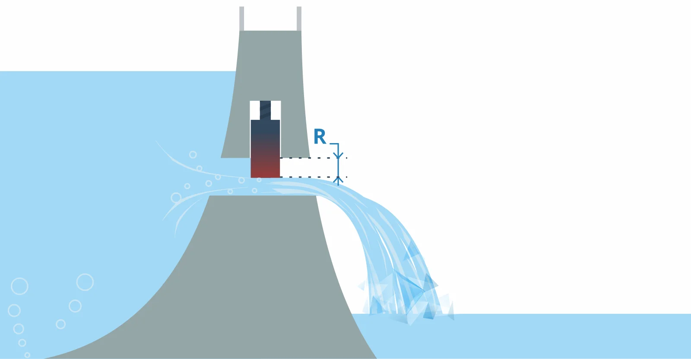

# Rezystancja (Opór)
### Definicja
Cecha obiektu do przeciwstawiania się przepływowi[[Prąd elektryczny| prądu elektrycznego]]

### Jednostka
Om $[\Omega]$

### Intuicja

Rezystancja określa jak bardzo przepływ wody jest utrudniony. Poziom otwarcia śluzy.

[[Elektronika]]